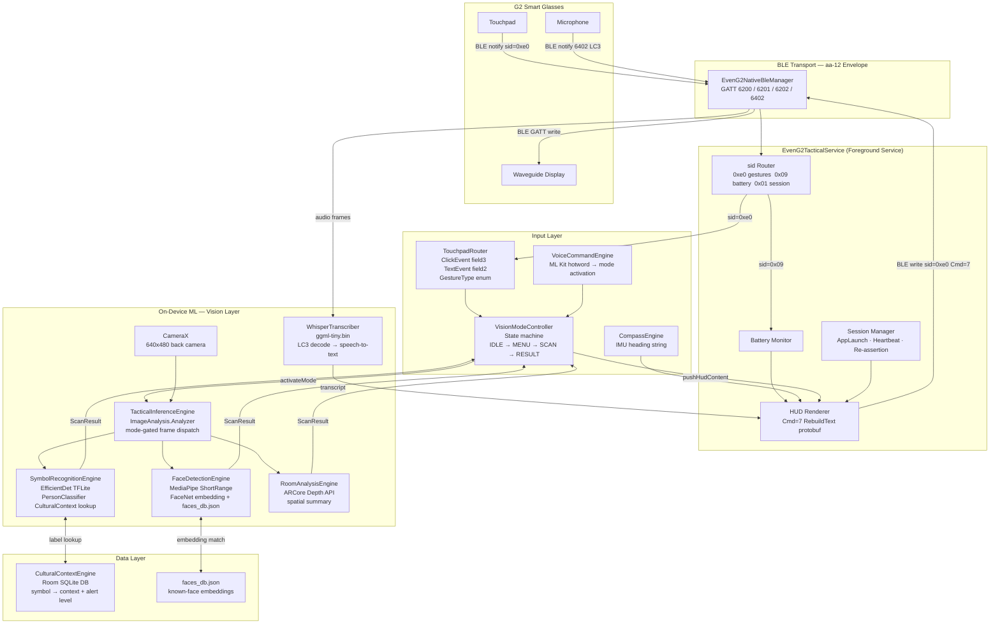

# PSYOP-VISR Architecture



## Layer Summary

| Layer | Components | Responsibility |
|-------|-----------|---------------|
| **Transport** | `EvenG2NativeBleManager` | Raw BLE GATT, aa-12 envelope framing, CRC, fragmentation |
| **Service** | `EvenG2TacticalService` | Session lifecycle, sid routing, HUD protobuf rendering, battery |
| **Input** | `TouchpadRouter`, `VisionModeController`, `VoiceCommandEngine`, `CompassEngine` | Gesture parsing, mode state machine, voice shortcuts, heading |
| **Vision** | `TacticalInferenceEngine`, `FaceDetectionEngine`, `SymbolRecognitionEngine`, `RoomAnalysisEngine`, `WhisperTranscriber` | On-device ML, frame dispatch, audio transcription |
| **Data** | `CulturalContextEngine`, `faces_db.json` | Tactical context DB, known-face embeddings |
| **Display** | G2 waveguide | Renders HUD pushed via BLE Cmd=7 RebuildText |

## Data Flow — Tap to Scan Result

```
User tap on G2 touchpad
  → BLE notify sid=0xe0 (ClickEvent field3, clickType=1)
  → TouchpadRouter.parseEvenHubEvent() → GestureType.TAP
  → VisionModeController.onGestureEvent(TAP)
  → [IDLE] enterMenu() → pushHudContent(menu)
  → [MENU] TAP → startCountdown(selectedMode) → isScanActive=true
  → TacticalInferenceEngine dispatches frames to selected engine
  → Engine returns ScanResult (FaceResult / SymbolResult / RoomResult)
  → VisionModeController.onScanFrame(result) → showResult() → pushHudContent(result)
  → EvenG2TacticalService.pushHudContent() → Cmd=7 RebuildText → BLE write → G2 display
```
