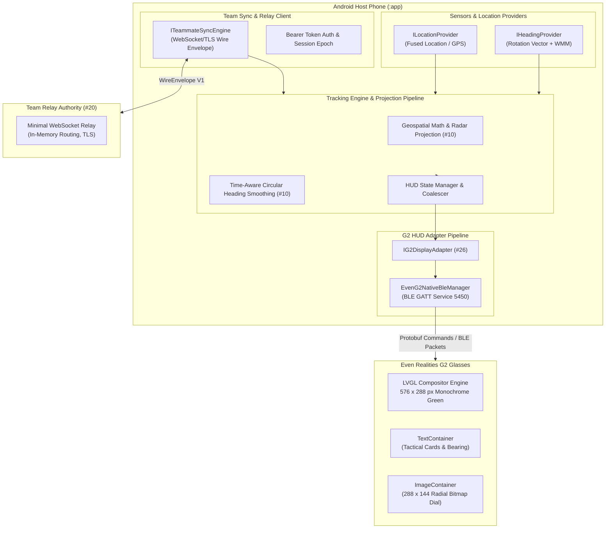

# G2 Teammate Tracking HUD: System Architecture & Domain Contract

> **Document Status:** Frozen Architecture Decision Record (ADR) & Domain Contract  
> **Repository Context:** `CarsonTitus/SOCOMIgnite2026`  
> **Tracking Issue:** [#6](https://github.com/CarsonTitus/SOCOMIgnite2026/issues/6) (Consolidates superseded issues [#1](https://github.com/CarsonTitus/SOCOMIgnite2026/issues/1), [#5](https://github.com/CarsonTitus/SOCOMIgnite2026/issues/5), [#7](https://github.com/CarsonTitus/SOCOMIgnite2026/issues/7), [#8](https://github.com/CarsonTitus/SOCOMIgnite2026/issues/8))  
> **Upstream Dependency:** [#2](https://github.com/CarsonTitus/SOCOMIgnite2026/issues/2) (docs/teammate-hud/capabilities.md)  
> **Downstream Blocked Issues:** [#10](https://github.com/CarsonTitus/SOCOMIgnite2026/issues/10), [#14](https://github.com/CarsonTitus/SOCOMIgnite2026/issues/14), [#20](https://github.com/CarsonTitus/SOCOMIgnite2026/issues/20), [#21](https://github.com/CarsonTitus/SOCOMIgnite2026/issues/21), [#22](https://github.com/CarsonTitus/SOCOMIgnite2026/issues/22), [#24](https://github.com/CarsonTitus/SOCOMIgnite2026/issues/24), [#26](https://github.com/CarsonTitus/SOCOMIgnite2026/issues/26)

---

## 1. System Overview & Component Architecture

The **Teammate Tracking HUD** provides real-time geospatial awareness of friendly squad members directly within the Even Realities G2 smart glasses heads-up display.

The host application runs on Android (minSdk 26, targetSdk 34, compiled on JDK 17, Kotlin 1.9.0 / AGP 8.2.0). The system coordinates location tracking, sensor fusion, network relay synchronization, and rendering onto the optical waveguide display of the G2 glasses via BLE.

---

## 2. Phone / G2 Runtime Path & Seams

### Host Scaffold Selection
- **Selected Host:** The existing Android single-module project (`:app`) under `app/src/main/java/com/evensocom/psyopvisr/`.
- **Package Hierarchy:** New tracking components live under package `com.evensocom.psyopvisr.tracking`:
  - `tracking/domain`: Core domain models, enums, budgets, and provider interfaces.
  - `tracking/protocol`: Versioned wire envelope schema, serialization, and payload builders.
  - `tracking/geo`: Geospatial math and coordinate transformations (owned by #10).
  - `tracking/filter`: Sensor filtering and heading smoothing (owned by #10).
  - `tracking/sync`: Network synchronization engine (owned by #21).
  - `hud/g2`: G2 display adapter and BLE frame chunking (owned by #26).
- **Service Integration:** Existing `EvenG2TacticalService` retains lifecycle ownership of the background foreground service, BLE GATT connection, and mode routing. Teammate tracking HUD integrates as an explicit operational mode alongside existing face detection, object recognition, and Arabic audio translation.

---

## 3. Team Relay Architecture & Provisioning Model

### Design Choice: Minimal Lightweight Team Relay Authority (#20)
- **Protocol:** JSON-over-WebSocket with TLS (`wss://`).
- **Authorization:** Ephemeral Bearer token provisioning (`auth`). Tokens are injected into the client upon team rendezvous or generated from shared squad credentials.
- **Team Isolation:** The relay server isolates data strictly by `teamId`. Clients in team `ALPHA` cannot receive, discover, or inspect packets from team `BRAVO`.
- **Identity & Spoofing Guard:** Server binds the authenticated connection to `senderId`. Any client transmitting a packet where `senderId` mismatches the authenticated socket session is dropped with an `ERROR` code 403 (FORBIDDEN).
- **Data Retention & Privacy (Zero-Retention Policy):**
  - Ephemeral in-memory routing only.
  - **No telemetry is written to disk or database** (`TrackingBudgets.ZERO_LOCATION_DISK_RETENTION = true`).
  - Upon team session termination or member departure (`LEAVE`), member coordinate records are immediately expunged from memory.

---

## 4. Frozen Domain, Protocol & HUD Contracts

### Domain Models (`com.evensocom.psyopvisr.tracking.domain`)
1. **`Teammate`**:
   - `id: String` (1..64 chars, regex `^[a-zA-Z0-9_-]+$`)
   - `callsign: String` (1..32 chars, sanitized UTF-8, no control characters)
   - `latitude: Double` (finite, `[-90.0, +90.0]`)
   - `longitude: Double` (finite, `[-180.0, +180.0]`)
   - `altitudeMeters: Double?` (finite, `[-1000.0, +20000.0]`)
   - `headingDegrees: Double?` (finite, `[0.0, 360.0)`) — **Crucial invariant:** `null` indicates heading is absent, distinct from `0.0°` (True North).
   - `accuracyMeters: Float` (finite, `>= 0.0`)
   - `timestampEpochMs: Long` (UTC epoch timestamp of remote measurement)
   - `receivedMonotonicMs: Long` (Monotonic clock timestamp of local receipt, e.g. `SystemClock.elapsedRealtime()`)
2. **`LocationFix`**:
   - Local GPS/GNSS position with finite coordinate bounds, accuracy, optional altitude/speed/bearing.
3. **`HeadingSample`**:
   - `headingDegrees: Double` (`[0.0, 360.0)`)
   - `source: HeadingSource` (`PHONE_ROTATION_VECTOR`, `PHONE_GEOMAGNETIC_ROTATION_VECTOR`, `GPS_COURSE_OVER_GROUND`, `G2_RELATIVE_IMU`, `MANUAL_OVERRIDE`, `UNAVAILABLE`)
   - `reference: NorthReference` (`TRUE_NORTH`, `MAGNETIC_NORTH`, `RELATIVE_ARBITRARY`, `UNKNOWN`)
   - `quality: HeadingQuality` (`HIGH`, `MEDIUM`, `LOW`, `UNRELIABLE`)
   - `alignment: MountAlignment` (`HEAD_ALIGNED`, `CHEST_TORSO_ALIGNED`, `HANDHELD`, `POCKET_LOOSE`, `UNKNOWN`)
4. **`TeamSnapshot`**:
   - Immutable snapshot with `teamId`, `sequence`, `sessionEpoch`, and `Map<String, Teammate>`.
5. **`RadarPoint` & `HudState`**:
   - `RadarPoint`: Projected 2D coordinates `(x, y)` bounded by G2 display container (288x144), `distanceMeters`, `relativeBearingDegrees` in `[0.0, 360.0)`, and relative 12-hour clock face hour `clockHour` (1..12).
   - `HudState`: Complete immutable frame containing mode, status flags, wearer fix, heading, radar points, range, text cards, and monotonic generation counter.

---

## 5. Wearer Heading Decision & Explicit Degradation Policy

As established by [#2](https://github.com/CarsonTitus/SOCOMIgnite2026/issues/2) evidence:
1. **The G2 glasses DO NOT have an onboard magnetometer/compass.** The G2 6-axis IMU emits only relative gyro/accelerometer data. Raw IMU axes **must not** be labeled or used as magnetic or true north.
2. **Phone Heading Fallback:** Orientation is derived from the phone's rotation vector sensor fused with the World Magnetic Model (`GeomagneticField`) to yield True North.
3. **Mount Alignment & Degradation Rules:**
   - **Head-Mounted Phone:** Certified wearer heading glance direction.
   - **Chest / Torso Mount:** Certified torso direction only, flagged `TORSO_ALIGNED_ONLY`.
   - **Pocket / Loose Phone:** **CANNOT claim wearer heading.** Heading is discarded; HUD displays `NO_HEADING` warning and falls back to north-up orientation or text relative indicators.
   - **Stationary GPS Course:** When ground speed is `< 1.5 m/s`, GPS course is discarded and cannot substitute for heading.
   - **Moving GPS Course:** When ground speed is `≥ 1.5 m/s`, GPS course represents movement trajectory, not head glance. Flagged as `GPS_COURSE_FALLBACK` ("CRS-UP").
4. **Unsupported Radial Rendering:** Because G2 firmware has no hardware vector graphics or line-drawing canvas, arbitrary drawing is strictly unsupported. Any failure in the 288x144 bitmap pipeline must degrade cleanly to structured text cards (`T1: 120m [02:00]`), rather than faking unsupported canvas drawing.

---

## 6. Measurable Budgets & Default Parameters

| Parameter | Frozen Value | Architectural Rationale |
| :--- | :--- | :--- |
| **Max Team Members** | 16 | Squad tactical limit; keeps JSON and G2 text cards strictly bounded |
| **Max Wire Message Size** | 4,096 bytes | Guarantees bounded buffer footprint and low network serialization cost |
| **Max Queue Depth** | 32 frames | Prevents slow network/BLE consumers from causing OOM crashes |
| **Freshness Threshold** | 10,000 ms (10s) | Telemetry older than 10s is marked stale (`isStale = true`) |
| **Stale Prune Threshold** | 60,000 ms (60s) | Peers inactive for >60s are expunged from the active snapshot |
| **Max Future Timestamp Skew** | 5,000 ms (5s) | Rejects packets with future clocks caused by unsynced or malicious peers |
| **Max Past Timestamp Skew** | 300,000 ms (5m) | Rejects replayed historical telemetry |
| **Default Radar Range** | 500.0 meters | Tactical squad spacing baseline |
| **Max Radar Range** | 5,000.0 meters | Viewport perimeter clipping upper bound |
| **G2 Image Max Rate** | 1.0–2.0 Hz (≥500ms) | Firmware 100ms pacing floor and BLE throughput limit |
| **G2 Text Upgrade Rate** | 2.0–5.0 Hz (≥200ms) | Fast, responsive text HUD updates |
| **G2 BLE Heartbeat** | Every 20,000 ms (20s) | Prevents G2 firmware session timeout (timeout occurs at 60s) |
| **Local Pipeline Latency** | < 50 ms | Total elapsed time from sensor callback to `HudState` composition |
| **Relay Transit Latency** | < 250 ms | Expected end-to-end network hop |
| **Memory Footprint** | < 10 MB | Maximum heap overhead allocated to tracking stack |

---

## 7. Verification & CI Setup

- **Gradle Build & Unit Tests:** `./gradlew testDebugUnitTest`
- **Android Lint Verification:** `./gradlew lintDebug`
- **GitHub Actions Workflow Template:** `docs/teammate-hud/ci/android-ci.yml` running on Java 17 (Amazon Corretto) and ubuntu-latest runner.
- **Probe Suite:** `G2CapabilityProbeRunner.kt` verifies native CRC-16, protobuf framing, bearing math, and container bounds without needing physical glasses, external models, or secrets.
- **Domain Contract Suite:** `TrackingDomainContractTest.kt` verifies finite coordinate bounds, absent vs 0° heading distinction, age vs monotonic receipt separation, Unicode sanitization, and wire serialization.
